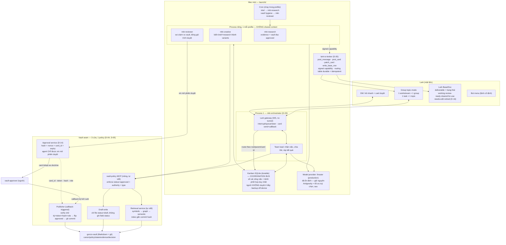
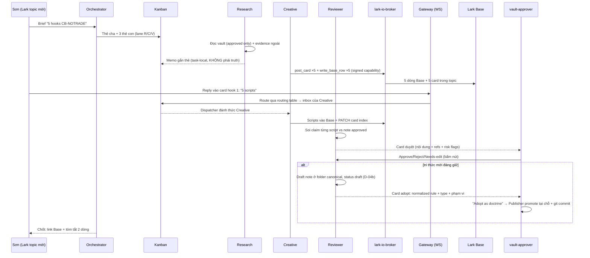

# Kiến trúc Agent Team: Hermes + Gonzo Vault

> Bản kiến trúc ĐÍCH, standalone (không phụ thuộc legacy runtime). Hợp nhất 3 nguồn:
> deep-dive Hermes v0.18.2 (`hermes-architecture-gonzo-mapping.md`, 2026-07-24),
> cross-vision deep research ngoài (`deep-research-report.md`, 2026-07-25),
> và Lark UX research (`plans/reports/researcher-260725-0916-lark-interactive-ux-report.md`).
> Trạng thái: **APPROVED-DESIGN, chưa build.** Mỗi quyết định có mã D-xx để trace.
> Vòng grill 2026-07-25 đã sửa/thêm: D-03, D-04 (retrieval tự viết, đầy đủ), D-04a (read
> contract), D-04b (draft-write A+), D-05, D-12, D-13…D-21.
>
> **Tài liệu này sống ở repo runtime `gonzo-hermes`**, không nằm trong vault — vault phải
> sống sót khi runtime bị thay (P1). Mọi link trỏ sang `gonzo-vault` là **URL repo**, cố ý
> không phải relative link, để không giả vờ hai repo là một. Phần quyết định chạm
> governance đã ghi vào vault thành 2 decision record:
> [agent-team-architecture](https://github.com/jessebldr/gonzo-vault/blob/main/decisions/records/2026-07-25-agent-team-architecture.md)
> (approved) và
> [marketing-approval-delegation](https://github.com/jessebldr/gonzo-vault/blob/main/decisions/records/2026-07-25-marketing-approval-delegation.md)
> (draft — chờ `company-lead` xác nhận).

## 0. Mục tiêu & nguyên tắc bất biến

Team ~8 người vận hành brand Kyperus (US e-commerce). Mục tiêu: team agent marketing
(research → creative → review) làm việc với người thật qua Lark, tri thức công ty do
người duyệt, agent không bao giờ tự đặt ra sự thật.

Sáu nguyên tắc mọi thành phần phải tuân theo:

| # | Nguyên tắc | Hệ quả kiến trúc |
|---|---|---|
| P1 | **Vault owns truth** — vault (Markdown+git, repo `gonzo-vault`) độc lập mọi runtime | Hermes chết/thay → tri thức nguyên vẹn. Không format riêng của tool nào lọt vào vault |
| P2 | **Agents draft-only** — agent đọc note `approved`, viết ra chỉ được `draft` | Mọi đường ghi vào vault đi qua policy layer, không có tool ghi tự do |
| P3 | **Một cổng duyệt** — duy nhất `vault-approver` (người) promote draft→approved | Publisher là service tách riêng, có nút bấm cho người, agent không gọi promote được |
| P4 | **Chat để nói, bảng để nhớ** — Lark là mặt tiền; trạng thái công việc sống ở Kanban, deliverable sống ở Base/Doc | Thread lạc/WS chết không mất sự thật vận hành. Kèm 2 điều kiện: Kanban phải có backup off-device (Gate 2), và **từ `approved` không được dùng ngoài vault** (D-16) |
| P5 | **Memory không phải truth** — memory runtime chỉ chứa hành vi, không chứa fact công ty | **Cấm mọi memory/skill write không đi qua policy scanner** trên production (D-15) — không phải tắt memory; không external memory provider ở phase 1 |
| P6 | **Mở rộng bằng cách cắm tool** — năng lực mới (ads, Shopify…) = MCP server cắm thêm, không đổi khung | Thêm vai = thêm profile (một process nữa, D-03); thêm khả năng = thêm MCP mount |

## 1. Sơ đồ tổng

## 2. Tầng vai trò (profiles)

**D-01 — 4 vai, không nhiều hơn.** Gom theo chức năng, hai nguồn thiết kế độc lập
(mình + deep research ngoài) hội tụ cùng đáp án:

| Profile | Nhiệm vụ | Được phép | KHÔNG được phép |
|---|---|---|---|
| `mkt-orchestrator` | Nhận brief, tạo thẻ Kanban cha + con, gán lane, ráp output, trả lời thread | Kanban full, vault read | Tự làm deliverable, ghi vault |
| `mkt-research` | Evidence ngoài (web/Apify/scripts) + tri thức approved trong vault → memo gắn vào thẻ | Vault read, web, draft-write | Đưa memo chưa duyệt thành "fact" |
| `mkt-creative` | Brief + memo → hooks/scripts/variants, ghi vào Base; visual: image-gen toolset native Hermes + video qua pipeline Veo (MCP/script riêng — Hermes không có video-gen) | Vault read, Base write, image/video tools | Dùng note `status: draft` làm tri thức nền |
| `mkt-reviewer` | Soi từng claim với note approved, flag claim chỉ dựa memo, viết publication-candidate (draft) + gửi card adopt kèm normalized rule (D-13) | Vault read + draft-write, gọi adoption card | **Promote.** Và không được đưa doctrine tự suy ra lên card adopt — phải hỏi người hoặc mở open-question |

**D-02 — Kanban là xương sống điều phối, không phải chat/delegation.**
Delegation nền của Hermes không sống qua restart; Kanban (SQLite, worker lanes,
reviewer gate) thì có. Quy tắc: việc bền = thẻ Kanban có assignee; delegation chỉ
dùng fan-out ngắn trong 1 phiên chat đang sống. Cron cho việc định kỳ — **mỗi cron
job chạy trong một profile cụ thể** (fresh session): intel → `mkt-research`,
vault hygiene → `mkt-reviewer`.

**Kanban là sổ nội bộ của agents — không phải giao diện duyệt của người.** Thẻ
"done" do `mkt-reviewer` (agent) gate. Người thật chỉ có đúng 2 điểm chạm trong
toàn hệ: (1) card Approve trên Lark khi deliverable ra lò, (2) duyệt tuần cho
draft note vào vault. Không ai phải mở Kanban trừ khi muốn soi tiến độ.

**D-12 — Tự do trong vùng, gate ở biên.** Agents giữ **toàn bộ khả năng tự học
procedural** của Hermes gốc: tự tạo skill sau vài lần lặp việc, memory, chủ động đề
xuất, chạy nền. **Factual learning thì không** — fact chỉ được lưu trong vault, hoặc
được truy vấn từ vault tại runtime (D-15). Bốn cánh cửa bị gate: (a) cái gì thành sự
thật công ty (adoption event, D-13/D-14), (b) cái gì ra mặt khách hàng (card Approve),
(c) cái gì đụng tiền (Shopify write, phase sau), (d) **cái gì được nạp vào context như
active instruction** (pre-load scanner, D-15). Bài học từ hệ trước: thiếu gate truth →
agent tự bịa rule thành canon; siết hành vi để vá → agent rigid. Thiết kế này gate
truth chứ không gate hành vi.

**D-03 — Process-per-profile ngay từ đầu; Kanban là coordination bus.** Bản trước chọn
multiplex 4 profile trong 1 process theo KISS. Bỏ, vì nó tự mâu thuẫn: D-06 loại một
external memory provider **chính vì cross-profile bleed**, rồi lại gom 4 profile vào
chung một process mà không nói gì ngăn chúng thấy nhau — isolation thành giả định thay vì
thiết kế. Ranh giới ở đây là thật: `mkt-creative` không được dùng note draft làm nền,
trong khi `mkt-reviewer` là đứa sinh ra draft. Topology cuối:

- **`mkt-orchestrator` = process 1**, đồng thời **host Lark gateway** và làm team lead.
- **`mkt-research` / `mkt-creative` / `mkt-reviewer` = worker process riêng**, mỗi cái một
  profile.
- **Cả 4 dùng chung một Kanban durable làm coordination bus** — task, dependency, comment,
  block, structured handoff. Không shared context, không shared memory trực tiếp.
- Mỗi profile có **session, memory, skills, staging, scanner và credential riêng**.
  Credential riêng là thứ biến audit log từ "Hermes ghi cái này" thành "`mkt-reviewer` ghi
  cái này lúc X" — đúng chất lượng provenance mà vault này được dựng lên để có.
- **`team_ask`** — wrapper để agent A hỏi agent B: tạo một **child task**, chờ kết quả
  hoặc đi tiếp async. Hỏi nhau là một thẻ, không phải một lời nhắn trong context chung.

## 3. Tầng tri thức (vault seam)

**D-04 — Tự viết `vault-policy` + retrieval service, đầy đủ ngay từ đầu.**
**Không có khái niệm v1/v2 ở tầng này** — gate chỉ là thứ tự triển khai và kiểm thử, không
phải mức độ hoàn chỉnh của thiết kế. Sau read contract (D-04a), phần *có ý nghĩa* của seam
đều là luật riêng của vault này; thứ một MCP ngoài cung cấp chỉ còn là cái index. Hệ
retrieval gồm đủ 7 thành phần:

1. lọc theo frontmatter / `type`;
2. khớp title, heading, tag, alias;
3. BM25 / full-text;
4. mở rộng theo wikilink + relative-link graph;
5. semantic embedding — **fallback/rerank**, luôn chạy **sau** symbolic;
6. bundling open-question (lane riêng, D-04a);
7. `use_class` + multi-note flags.

**Index không phải source of truth.** Policy layer **đọc lại file Markdown gốc** trước khi
trả kết quả — index chỉ để tìm ứng viên. Index lưu local và **gắn với git commit hash**:
commit hiện tại khác commit đã index → **rebuild trước khi phục vụ query**. Hệ quả:
**production không chấp nhận trạng thái `index_stale`** — nó không phải thứ để "khai báo
trung thực", nó là thứ không được phép tồn tại.

`markdown-vault-mcp` **không phải dependency bắt buộc**. Chỉ adopt nếu Gate 0 chứng minh
cả 4: ①sống + license dùng được ②đủ symbolic **và** semantic ③không cản ràng buộc
commit-hash ④thật sự **giảm** lượng code phải bảo trì. Không đạt → dùng implementation
nội bộ, vốn đã đủ.

Ba việc của `vault-policy` phía trước:

1. **Trả kết luận, không trả nguyên liệu** (read contract, D-04a bên dưới).
2. **Symbolic trước, vector sau** — thứ tự 1→5 ở trên là bắt buộc, không đảo. Vault toàn
   note atomic có cấu trúc; semantic là lưới vét, không phải cửa vào.
3. **Draft-write: gate theo `status`, không gate theo thư mục.** Không có `_drafts/`.
   Chi tiết ở D-04b.

**D-04a — Read contract: policy layer trả *quyền dùng*, không trả nguyên liệu suy luận.**
Đưa số `authority` thô ra model là mời nó phân xử tranh chấp — đúng thứ
[grounding-policy](https://github.com/jessebldr/gonzo-vault/blob/main/governance/grounding-policy.md) cấm (*"Not by authority number, not by
date, not by confidence"*). Cấm bằng system prompt là gate-bằng-lời-dặn, cùng hạng với
"đừng bấm nút mà không đọc". Nên:

- `authority` dùng **nội bộ** policy layer để xếp thứ tự retrieval, **không** trả số ra model.
- Mỗi kết quả mang đúng một **`use_class`** đã tính sẵn từ frontmatter:
  `citable` · `suggestion-only` (authority 5 — external practice) · `unverified` (draft) ·
  `stale` (quá `review_after`) · `undecided` (open-question đang hiệu lực) ·
  `historical-only` (superseded).
- Model **không bao giờ** tự suy quyền dùng từ `authority` / `status` / `freshness` — nó
  không nhìn thấy ba trường đó ở dạng thô.

**Open-question là một lane riêng, không phải kết quả rơi rớt.** Lọc `approved`-only sẽ
giết mất `decisions/open/` — và thế là vi phạm invariant 4: agent không thấy vùng chưa
quyết thì sẽ lấp nó bằng suy luận. Vì vậy mỗi truy vấn chạy **thêm một lane** tìm
open-question liên quan qua `affects` + wikilink-graph + symbolic search:

- Open-question **đang hiệu lực** → bundle vào kết quả, `use_class: undecided`.
- Task phụ thuộc một open-question → agent nói **"chưa quyết"** và **dừng**. Không suy ra đáp án.
- Open-question `superseded` chỉ trả khi truy vấn lịch sử hoặc cần lần theo resolution —
  nó không phải blocker hiện tại (`use_class: historical-only`).

**Conflict v1 — chặn việc gộp im lặng, chưa phán mâu thuẫn.** Từ 2 note approved
materially relevant trở lên: trả **riêng từng note**, kèm `multiple_relevant_notes: true`
và `requires_multi_cite: true`. Agent **không được âm thầm gộp** thành một rule. Đây
**không** gọi là conflict detection — nó chỉ chặn gộp. Conflict detection thật
(supersedes graph, single-home, mâu thuẫn ngữ nghĩa) để **Gate 6**, vì ở Gate 3 nó vừa
khó vừa chưa cần.

**D-04b — Hợp đồng draft-write (A+): vault không uốn theo runtime.** Phương án
`_drafts/` của bản trước **vỡ** khi đối chiếu vault thật: `validate_vault.py` ép folder
theo `type` (`TYPE_HOME`: evidence→`/evidence/`, operational-state→`/state/`,
open-question→`/decisions/open/`), nên draft trong `_drafts/` là **error**; và
`created_by` / `task_id` / `based_on` không nằm trong `KNOWN_KEYS` nên mỗi draft đẻ
thêm 3 error. Gate của publisher (D-05) sẽ fail 100%. Ngoài ra `task_id` trỏ ra SQLite
ngoài repo — trái P1 và trái
[decision provenance-points-to-people-not-paths](https://github.com/jessebldr/gonzo-vault/blob/main/decisions/records/2026-07-24-provenance-points-to-people-not-paths.md).
Hợp đồng đúng:

- Draft sinh ra **thẳng trong folder canonical theo `type`**, `status: draft`. Bỏ hẳn
  `_drafts/`.
- Allowlist là **status, không phải path**: agent chỉ được tạo file mới hoặc sửa file
  đang ở `status: draft`. Không bao giờ chạm file `status: approved`/`superseded`, và
  **không bao giờ ghi field `status`** (kể cả ghi lại đúng giá trị cũ).
- **Không thêm key mới vào frontmatter.** Schema vault giữ nguyên. Provenance runtime đi
  vào `sources` dưới dạng chuỗi hợp lệ sẵn có, ví dụ
  `"hermes/mkt-reviewer draft, 2026-07-25"`.
- Note approved mà draft dựa vào nằm **trong body**, mục `## Based on`, bằng relative
  link — validator đã kiểm link tồn tại sẵn, không cần cơ chế mới.
- `task_id`, card ID, session ID, profile: **ở Kanban + publisher log**, không vào vault.
- Draft nằm lẫn trong folder canon là chấp nhận được vì `status` đã là trục lọc thật của
  [grounding-policy](https://github.com/jessebldr/gonzo-vault/blob/main/governance/grounding-policy.md) — policy layer (D-04 §1) lọc
  approved-only trước khi tới agent.

**D-05 — Publisher tách riêng draft-writer.** Promote là thao tác **tại chỗ**: không
move, không rename (giữ nguyên path ⇒ không vỡ relative link nào, kể cả các link
`## Based on` trỏ tới nó). Publisher là service duy nhất được ghi field `status`:
đối chiếu **content hash** của bản người đã duyệt trên card với file trên đĩa (khớp mới
đi tiếp — chặn drift giữa lúc render card và lúc bấm nút) → thêm `approved_by` +
`approved_at` (+ `supersedes` nếu có) → chạy `tools/validate_vault.py` → git commit.
Trigger duy nhất: **adoption event** của domain approver (D-13) — trên card Lark hoặc CLI
tay. Reject → note ở lại `draft` kèm lý do; hash lệch → từ chối, báo lại người duyệt,
không tự promote. Publisher **thực thi** quyết định của domain approver, nó không phải
người quyết.

**D-13 — Human-originated hoặc explicitly adopted.** Agent **được** soạn draft cả
`canon`, `policy`, `playbook`, `decision` — không cắt theo type. Cái bị cắt là điều kiện
promote: draft chỉ đủ điều kiện khi có một **adoption event** từ người có thẩm quyền
theo domain.

Adoption event **hợp lệ** đúng 2 dạng:

1. Người trực tiếp phát biểu / correct một rule trong chat **và** yêu cầu lưu lại;
2. Agent **phản chiếu lại chính xác rule đã normalize**, rồi người trả lời rõ ràng
   "đồng ý lưu thành canon/policy/decision".

**Không** tính là adoption: "hay", "ok", "looks good", reaction emoji, hoặc bấm nút mà
trên card **không hiện normalized rule**. Đây là chỗ gate thật nằm — không nằm ở cái nút.

Hệ quả:

- "Tạo bản nháp / lưu lại cái này" → chỉ tạo `status: draft`. Không bao giờ kèm promote.
- **Agent-inferred doctrine không được promote thẳng.** Agent tự suy ra một rule thì phải
  hỏi `company-lead` / `subject-matter-owner (<domain>)`, hoặc mở
  `open-question` trong [decisions/open/](https://github.com/jessebldr/gonzo-vault/tree/main/decisions/open) — không tự đưa lên card adopt.
- **Thẩm quyền nội dung phân tán theo domain** (quyết định tổ chức, 2026-07-25 — đã ghi
  vào [company/approval-authority.md](https://github.com/jessebldr/gonzo-vault/blob/main/company/approval-authority.md), là chỗ duy nhất
  vault chấp nhận ghi delegation):

  | Domain | Content approver | Người |
  |---|---|---|
  | Marketing, ads, creative, customer research, e-commerce execution | `marketing-lead` | Sơn |
  | Pricing, legal, brand tier, business-level decisions | `company-lead` | Trung |
  | Publisher, schema, validator, integrity | `vault-approver` | Khánh |

  **`vault-approver` là cổng kỹ thuật duy nhất đổi `status` — nhưng không phải người
  quyết nội dung của mọi domain.** Hai chữ ký, hai vai: domain approver quyết nội dung
  *xứng đáng*, vault-approver/publisher thực hiện việc đổi status. Kèm theo:
  `marketing-lead` đã chuyển từ reserved → active (Sơn), và validator được vá để chấp
  nhận dạng qualified `subject-matter-owner (<domain>)` mà `roles.md` vốn đã bắt buộc —
  phục vụ các domain sau (3D, media).
- Card xác nhận **bắt buộc** hiện 4 thứ: ①normalized rule ②`type` ③phạm vi ảnh hưởng
  (note nào bị đụng / bị supersede) ④nút **"Adopt as doctrine"** — không dùng nút
  "Approve" chung chung, vì nút chung chung là thứ người ta bấm mà không đọc.
- Luật vault phải đổi một câu (§9): grounding-policy từ *"when a human writes it"* thành
  *"when a human originates, materially edits, or explicitly adopts it as doctrine"*.

**D-14 — Adoption phải kiểm được bằng máy; agent không nằm trên đường authorization.**
Trong 2 dạng adoption của D-13, dạng (2) kết thúc bằng một callback do Lark gửi — có
`card_id`, `user_id`, chữ ký; dạng (1) chỉ tồn tại trong phán đoán ngôn ngữ của model.
Nếu agent được quyền khẳng định "adoption đã xảy ra" thì gate đang do chính thứ nó kiềm
chế canh giữ, và một câu *"ừ chuẩn đó"* bị phân loại nhầm sẽ đẻ ra canon **im lặng**.
Vì vậy:

- **Dạng (1) là trigger, không phải authorization.** Người phát biểu rule trong chat →
  agent chỉ được làm 2 việc: ghi `status: draft`, và **xin approval service mở phiên
  duyệt**. Không hơn.
- Agent **không** truyền cờ `adopted=true`, **không** gọi promote, không cầm token.
  Nó không thể giả mạo thứ nó không cầm.
- **Approval service** tự tính `content_hash` của draft, tự sinh one-time token/nonce,
  lưu bản ghi `{card_id, draft path, hash, approver role, expiry, used=false}`, rồi
  render card "Adopt as doctrine".
- **Publisher promote khi và chỉ khi** callback thoả **toàn bộ**: ①event/chữ ký hợp lệ
  từ Lark ②`card_id` + token khớp bản ghi ③`content_hash` của file trên đĩa chưa đổi
  ④button đúng là `Adopt as doctrine` ⑤`user_id` map được sang role có quyền trong domain
  của note đó ⑥token chưa dùng và chưa hết hạn. Thiếu một điều kiện → từ chối, ghi log,
  báo lại người duyệt.
- Hệ quả sạch: "ok", emoji, câu nói tự nhiên **chỉ** có thể sinh draft + card. Không có
  callback thì không có commit — điều này đúng do **cấu trúc**, không do model ngoan.
- Mapping `lark_user_id → role/domain` sống trong **publisher runtime config**. Vault chỉ
  giữ role + bảng delegation ([company/team.md](https://github.com/jessebldr/gonzo-vault/blob/main/company/team.md) cấm platform ID trong
  vault). Hai bảng, join bằng role word.

**D-06 — Memory hành vi, không fact.** MEMORY.md/USER.md của profile chỉ chứa kiểu
"trình bày 3 variants + 1 control", "trả lời ngắn, link thẻ Kanban". Thi hành bằng
scanner tự động (D-15), không bằng mắt người. External memory provider: **không dùng
phase 1** (đã có bằng chứng cross-profile bleed ở provider ngoài). Correction từ team đi
theo luật vault: behavioral → memory; factual → draft note có provenance, chờ adoption.

**D-15 — Pre-load truth gate: procedural tự do, factual phải về vault.** Self-created
skill là kênh ghi truth **thứ hai** và nguy hiểm hơn vault: nó không phải note nên
`validate_vault.py` không thấy (kể cả check single-home đang canh `$419`), nhưng nó được
nạp thẳng vào context mỗi phiên — tức authority thực tế **cao hơn** note approved. Và
Hermes chết thì nó chết theo, trái P1. Luật:

**Được tự ghi và tự activate** (procedural): workflow · cách dùng tool · task
decomposition · formatting · bài học từ thất bại · quy trình verification.

**Không được tồn tại dưới dạng active instruction** (factual): giá · phần trăm và
threshold · product claim · operational-state · company/brand policy · bất kỳ fact nào
đã có canonical home trong vault.

Cơ chế thi hành — **gate trước khi load, không phải audit sau khi hỏng**:

1. Agent ghi memory/skill vào **staging**, chưa được load.
2. Scanner chạy **trước khi** file được nạp vào context.
3. Phát hiện business fact → **tự rewrite thành vault lookup** (literal → lời gọi
   vault-read tại runtime).
4. Lint lại: pass → tự activate · rewrite thất bại → **quarantine + log** · secret /
   prompt injection / mưu toan bypass vault → **hard block**.
5. Cron hygiene (D-02) chỉ để **audit drift + đọc git diff**, không phải gate chính.
6. Memory/skill dir được **git-track trong repo runtime riêng** (không phải vault) để
   rollback và để review nhìn 6 dòng diff thay vì đọc lại 4 file.

`$419` trong một skill/memory **active** là **error**, không phải warning: nó sao chép
một fact có single home ([brands/kyperus/state/commercial-state.md](https://github.com/jessebldr/gonzo-vault/blob/main/brands/kyperus/state/commercial-state.md))
và bản sao đó sẽ không đổi khi giá đổi. Chỉ được phép trong test fixture đã loại khỏi
production loader.

**Không có bước người duyệt memory/skill định kỳ.** Hệ tự xử lý; chỉ alert khi rewrite
thất bại hoặc chạm red-zone.

## 4. Tầng mặt tiền (Lark UX)

Toàn bộ bằng đồ native Lark — không build UI, chỉ soạn JSON card + gọi API.

**D-07 — Session hiện hình = topic.** 1 group/workstream (vd "Kyperus Creative"), bật
topic-mode. Sau khi tách process (D-03), ánh xạ chính xác là:

- **1 group = 1 workstream**;
- **1 user-visible task = 1 Lark topic**;
- **1 topic = 1 session orchestrator + N Kanban subtask** của specialist;
- **Kanban subtask KHÔNG tạo thêm Lark session riêng.**

Mở việc mới = mở topic mới — tương đương "mở session mới" của CLI agent. DM không có
thread (giới hạn cứng của Lark) → DM chỉ để hỏi nhanh, không làm việc dài.

**D-20 — Inbound tập trung, outbound qua capability broker.** Worker không còn kết nối
Lark, nhưng cũng **không** được bắt chảy nội dung qua context orchestrator — làm vậy thì
ranh giới *"orchestrator không tự làm deliverable"* (D-01) mất khả năng thực thi, vì
nội dung đã nằm trong context của nó rồi thì "ráp lại" với "sửa cho mượt" không phân biệt
được. Tách theo chiều:

- **Một bot identity, một WS gateway**, sống trong process orchestrator, nhận **toàn bộ**
  inbound event.
- Worker **không giữ Lark app secret**. Thay vào đó có **`lark-io-broker`** với API hẹp:
  `post_message` · `post_card` · `patch_card` · `write_base_row`.
- Worker gọi broker bằng **signed capability** gắn với `task_id` · `owner_profile` ·
  `topic_root_id` · danh sách action được phép.

**Outbound:** worker tạo deliverable/clarify card → gọi `lark-io-broker` → broker kiểm
capability, gửi **nguyên payload**, ghi lại `{message_id/card_id, task_id, owner_profile,
root_id, content_hash}`. Nội dung **không đi qua model context của orchestrator**.

**Inbound:** gateway nhận reply/card callback → route theo `root_id` / `parent_id` /
`card_id` → tra **routing table** ra `task_id` + `owner_profile` → ghi event vào **Kanban
inbox** của worker sở hữu task → dispatcher đánh thức đúng worker process.

**Routing table phải durable**, backup **cùng Kanban** (D-02), và **idempotent** — restart
giữa chừng không được gửi trùng card. Bảng này dùng chung với ánh xạ `card_id ↔
content_hash` mà D-14 vốn đã cần, không phải thêm hạ tầng mới.

**D-08 — Trả kết quả dạng nhiều message có địa chỉ.** 5 hooks = 5 message/card riêng.
User reply vào message hook nào, event mang `parent_id`/`root_id` → agent biết chính
xác đang sửa hook nào. Lịch sử mỗi hook tự gom thành nhánh riêng — giải bài "DM bãi rác".

**D-09 — Clarify-question = card native.** Khi agent chưa rõ: card 2.0 với 3 button
option + form input "type your own" (đều native). Bấm xong bot PATCH card tại chỗ
thành "✓ đã chọn" (cửa sổ 14 ngày) — không rác message mới. Callback đi qua đúng
WS đang có, không cần webhook/tunnel.

**D-16 — `approved` là từ của vault, không ai khác được mượn.** Nếu Base cũng có trạng
thái `approved` thì một từ mang hai nghĩa: trong vault = *đây là doctrine công ty*, ở Base
= *hook này được phép ra mặt khách*. Đó đúng là con bug `owner` mà
[governance/roles.md](https://github.com/jessebldr/gonzo-vault/blob/main/governance/roles.md) được viết ra để diệt — chỉ tệ hơn, vì nghĩa thứ
hai sống **ngoài** vault nên không validator nào chạm tới. Luật:

- `approved` **chỉ** dùng cho note vault đã thành doctrine.
- Trạng thái của Base (deliverable / task / campaign) dùng bộ riêng, không giao nhau:
  `working` · `review-ready` · `cleared-for-use` · `needs-edit` · `retired`.
- Phải áp **trước dòng Base đầu tiên** (Gate 5). Sau đó cả team đã quen mồm, không sửa được.

**D-10 — Deliverable sống ở Base, chat chỉ còn lệnh + link.** Mỗi hook/script = 1 dòng
Base có cột trạng thái (bộ từ vựng của D-16). Agent ghi qua Lark openapi MCC/MCP
chính chủ (`larksuite/lark-openapi-mcp`). Kèm 1 **living-index card** ghim đầu topic
(bot PATCH cập nhật) làm mục lục nhanh. Company-lead nhìn bảng thấy toàn cảnh, khỏi lội chat.

**D-11 — Lệnh: bot menu + card palette.** Lark không có slash autocomplete kiểu
Telegram. Dùng Bot Menu cố định (≤5 mục chính × 10 con: New task / Status / Approve
queue / Help) + `/help` trả card nút bấm cho lệnh động.

## 5. Luồng end-to-end (1 creative task)

Điểm mấu chốt: **agents cộng tác qua thẻ Kanban + artifact task-local**, KHÔNG qua
vault. Vault chỉ (a) phát tri thức approved ra, (b) nhận draft chờ người duyệt vào.
Và orchestrator **chỉ** nhận trạng thái, summary, dependency — **không được tự sửa
deliverable**; nội dung không bao giờ đi qua context của nó (D-20).

## 6. Mở rộng tương lai (không đổi khung)

| Nhu cầu | Cách cắm | Ghi chú |
|---|---|---|
| Đọc + phân tích ads (Meta) | MCP ads-read mount vào `mkt-research` | Output = memo/draft, vẫn qua duyệt |
| Shopify | Phase 1: MCP read-only (đơn/tồn kho/doanh thu) mount research+orchestrator. Phase 2: quyền ghi (giá, discount) bọc card Approve y hệt vault | Không bao giờ ghi thẳng không gate |
| Vận hành phình to | Profile thứ 5 `ops` | Thêm vai là thao tác thường, không redesign |
| Copy quan trọng | Mixture-of-Agents của Hermes (advisors + aggregator) | Bật chọn lọc, token đắt |
| Video pipeline | Script/MCP riêng (Hermes không có video-gen) | Giữ pipeline hiện có, cron gọi |

## 7. Rủi ro + đối sách

1. **Feishu topic↔session mapping của Hermes chưa chắc chuẩn** (issues 2026 còn rough).
   → Bài test bắt buộc Gate 1; chấp nhận vá adapter 20-30% — và vá đó là **commit trong
   fork** (D-19), không phải patch script bên ngoài. State thật ở Kanban nên thread lạc
   không mất việc (P4 đỡ).
2. **Tool ghi vault sửa nhầm note approved** (draft nay nằm cùng folder với canon) →
   không mount tool ghi generic; draft-write tool tự đọc `status` của file đích, từ chối
   mọi file không phải `draft` và từ chối mọi payload có chứa key `status`; validator
   trong publisher là lưới thứ hai (D-04b/D-05).
3. **Memory/skill thành truth chui** (kênh ghi truth thứ hai, authority thực tế cao hơn
   canon vì nằm trong prompt) → D-15: staging + scanner **trước khi load**, auto-rewrite
   fact thành vault lookup, quarantine khi không rewrite được. Không gate bằng mắt người.
4. **Retrieval stale/lẫn draft, hoặc agent tự phân xử bằng số authority** → D-04a:
   `use_class` tính sẵn, giấu `authority` thô, lane riêng cho open-question, chặn gộp
   im lặng; symbolic trước; và index gắn commit hash + đọc lại file gốc trước khi trả —
   `index_stale` không tồn tại trong production thay vì được "khai báo trung thực" (D-04).
5. **Adoption giả** — model phân loại nhầm một câu tán thành thành "đồng ý lưu thành
   canon" → canon mọc thêm dòng, im lặng, không truy được. → D-14: authorization chỉ đi
   qua callback ký bởi Lark, agent không cầm token; test âm ở Gate 5.
6. **Ổn định WS/launchd trên macOS** (Hermes watchdog chỉ có systemd) → health-check
   script nhẹ + KeepAlive; theo dõi 1 tuần ở Gate 5.
7. **Implementation phân mảnh và tri thức nằm ngoài repo** — đây là rủi ro thật của quy mô
   này, **không phải** "một người code không kịp". Một hệ mà cách vận hành chỉ tồn tại
   trong đầu người xây thì không rollback được, không bàn giao được, và không debug được
   bằng agent. → Đối sách là **cấu trúc, không phải nhân sự**: fork chính thức (D-19) ·
   7 workstream song song (D-21) · automated test cho từng bất biến · deploy/rollback
   reproducible bằng script · và **mọi quyết định được ghi cùng code**.

## 8. Build order — 7 tầng, mỗi tầng 1 gate

Lỗi ở đâu biết ngay ở đó: mỗi lần chỉ thêm 1 bộ phận.

| Tầng | Việc | Gate (đậu mới đi tiếp) |
|---|---|---|
| 0 | **Verify tiền đề** — chỉ còn thứ **sai thì gãy khung**: ①repo `lark-openapi-mcp` tồn tại/sống/license ②Kanban + card behavior đúng như docs ③test thực nghiệm limit card (size, số nút, PATCH rate — Lark không công bố). Riêng `markdown-vault-mcp` là **đánh giá tuỳ chọn** theo 4 tiêu chí ở D-04, không phải tiền đề. Antigravity **không** nằm trong Gate 0 nữa | Mọi claim đặt cược kiến trúc đã verify |
| 1 | **Truth-integrity suite viết + freeze trước khi bắt đầu tầng này** (D-17①). Cài uv + Hermes pinned, 1 profile, **9router qua `custom_providers` (provider production)**; nối Lark WS; group topic-mode + card test | Chat thông; **topic→session tách đúng, reply giữ context**; card bấm được + PATCH tại chỗ |
| 2 | 4 process (1 lead + 3 worker, D-03) + Kanban bus + `team_ask` + **pre-load scanner (D-15)**. **CHƯA nối vault** | Kịch bản "5 hooks" chạy trọn bằng chat+Kanban. **7 tiêu chí đậu**: ①Kanban chia sẻ chạy đúng giữa mọi process ②worker spawn đúng profile ③agent tạo được task/follow-up cho agent khác ④dependency + blocking handoff đúng ⑤restart gateway **hoặc** worker không mất việc ⑥**draft/memory/skill không bleed giữa profiles** (ghi fact đặc trưng vào memory `mkt-research` → `mkt-creative` phải không biết) ⑦audit log chỉ đúng profile đã thực hiện từng hành động ⑧`lark-io-broker` (D-20): worker gửi được card **không** cầm app secret; capability sai `task_id`/action → **từ chối**; kill broker giữa chừng rồi restart → **không gửi trùng card** (idempotency). **Baseline hệ cũ chụp ở đây** — chạy 24 task benchmark trên runtime cũ, lưu lại (D-17②). **Backup Kanban là tiêu chí đậu, không phải tuỳ chọn** — từ Gate 2 nó đã là sổ cái thật: dùng SQLite online backup API hoặc `VACUUM INTO` (**không** copy file DB đang chạy), ≥1 bản **off-device**, có retention + **restore test tự động**; schema/config git-track trong repo runtime, dữ liệu backup không chứa secret. Scanner: skill chứa `$419` hoặc một product claim → **không được activate** (rewrite thành vault lookup, hoặc quarantine); skill chỉ có workflow/formatting → activate bình thường; memory/skill dir đã git-track, rollback được |
| 3 | Read-only vault seam (adopt-then-wrap, read contract D-04a) | Agent trả lời có cite đúng note; draft không lọt; model **không** nhìn thấy số `authority` thô, chỉ thấy `use_class`. **Truth suite (D-17①) bắt đầu chạy regression từ đây**, và chạy lại sau mọi thay đổi retrieval/policy/prompt. Hai test âm bắt buộc: ①hai note approved cho kết luận khác nhau → agent **cite cả hai**, không tự chọn ②câu hỏi phụ thuộc một open-question đang hiệu lực → agent nói **"chưa quyết"** và không suy ra đáp án |
| 4 | Draft-write seam (status allowlist + `## Based on` trong body, D-04b) | Draft sinh ra ở đúng folder canonical theo `type`, `validate_vault.py` **pass sạch**; thử ghi đè 1 note `approved` và 1 payload có key `status` → **cả hai bị từ chối** |
| 5 | Publisher + card "Adopt as doctrine" + Base/living-index | 1 vòng draft→adoption event→promote **tại chỗ**→git commit sạch; path không đổi, không link nào vỡ; sửa file sau khi render card → hash lệch → publisher **từ chối**. Test âm bắt buộc (D-14), mỗi cái phải **từ chối + log**: ①callback giả mạo/không chữ ký ②đúng card nhưng sai `user_id` (không có quyền trong domain đó) ③hash stale — draft bị sửa **sau khi** card được tạo ④replay: bấm lại token đã dùng ⑤token hết hạn ⑥"ok"/emoji/card thiếu normalized rule → không promote. Cộng: doctrine agent tự suy → ra open-question, không ra card adopt. WS ổn 1 tuần. **Đo, không đoán** — 5 chỉ số: ①card/người/tuần ②queue age median + p95 ③tỷ lệ approve/reject/needs-edit ④tỷ lệ approve **không chỉnh sửa gì** (dấu hiệu rubber-stamp) ⑤số note được đẩy lên doctrine nhưng lẽ ra nên ở evidence/Base. Chạy thật 2 tuần rồi mới đặt ngưỡng cảnh báo — không chốt ngưỡng trước |
| 6 | Cron (vault hygiene, intel định kỳ) + bot menu + **2 acceptance suite** (D-17) + **export archive** | **Truth suite 100% + quality benchmark đạt ngưỡng + rollback drill pass → cutover reversible.** **Conflict detection thật** (supersedes graph + single-home + mâu thuẫn ngữ nghĩa) lên sóng, thay cho `multiple_relevant_notes` của v1. Export: deliverable `cleared-for-use` từ Base → `outputs/<brand>/` trong vault. Đây là **archive, không phải grounding source** (grounding-policy đã loại `outputs/` khỏi grounding — giữ nguyên). Không export mọi bản nháp: chỉ `cleared-for-use` hoặc milestone đáng giữ |

**D-21 — Mô hình thực thi: workstream song song, gate là acceptance test.** Phạm vi giữ
nguyên, build liên tục tới khi Gate 0–6 xong. Gate **không phải lịch chờ** — chúng là bài
kiểm tra chấp nhận; chỉ **production deployment** mới phụ thuộc gate liên quan đã pass.
Tầng sau được build trên branch riêng trong khi tầng trước còn đang sửa.

Bảy workstream độc lập, spawn coding agent riêng cho mỗi cái: ①Hermes fork + process
isolation ②Kanban + dispatcher + `team_ask` ③Lark gateway + I/O broker + routing
④vault retrieval/policy ⑤publisher + approval service ⑥memory/skill scanner ⑦backup,
test, deployment.

**Phân vai.** Khánh sở hữu toàn bộ mặt kỹ thuật: architecture · deploy · restart ·
rollback · restore · incident · cập nhật fork. Sơn và Trung **chỉ**: dùng hệ thống, duyệt
nội dung thuộc thẩm quyền, báo lỗi, cho feedback nghiệp vụ. **Không** yêu cầu họ hiểu
hạ tầng hay tự thực hiện rollback.

**Bus factor giảm bằng hệ thống, không bằng người.** Toàn bộ code/config/migration trong
git; không patch tay ngoài repo; production chạy từ release tag cố định của fork; deploy
và rollback **reproducible bằng script**; health check + auto-restart + backup/restore tự
động; test cho isolation, routing, approval, truth-integrity, idempotency. Log, decision
record và runbook phải đủ để **một coding agent đọc repo là tiếp tục debug được** — đó mới
là bản sao lưu tri thức thật, không phải một người thứ hai được đào tạo.

**Escape condition thay vì timebox.** Không timebox toàn dự án; chỉ đặt điều kiện thoát
cho từng dependency: topic-mode không pass routing test → chuyển **fallback UX đã định**;
một component upstream không đạt contract → thay bằng implementation nội bộ. **Không vá
vô hạn chỉ để giữ một lựa chọn kỹ thuật cũ.**

**D-19 — Fork Hermes ngay từ đầu; fork *là* runtime chính thức của công ty.** Không patch
tại chỗ, không giữ patch script ngoài git — kiến trúc này cần dispatcher, process
isolation và session routing riêng (D-03), nên "cài bản upstream rồi vá" sẽ thành một
installation không ai tái tạo được. Luật:

- Chọn **một commit/tag upstream làm baseline**, fork từ đó.
- Mac mini production **chỉ chạy release tag/commit của fork** — không chạy working tree.
- **Mọi sửa đổi là một commit có test** trong fork. Không có ngoại lệ "sửa nhanh trên máy".
- Giữ module nghiệp vụ **tách khỏi core** khi có thể: Lark adapter · `vault-policy` ·
  publisher · `team_ask` · profile config. Chỉ động vào Hermes core khi thật sự cần —
  dispatcher, process isolation, session routing, framework behavior.
- **Theo dõi upstream nhưng chỉ cherry-pick fix có chọn lọc.** Không auto-merge upstream
  `main` — merge mù vào một fork đã đổi dispatcher là cách nhanh nhất để mất một tuần.

**D-17 — "Golden set" bị thay bằng hai acceptance suite độc lập.** Một cái tên không phải
tiêu chí. Và "đúng" với "hay" là hai thứ khác bản chất — gộp chung một điểm số thì cái
thứ hai sẽ nuốt cái thứ nhất. Tách hẳn:

**① Truth-integrity suite** — viết, version-control và **freeze trước Gate 1** (chỉ dựa
vào luật trong [governance/](https://github.com/jessebldr/gonzo-vault/blob/main/governance/index.md), không cần biết hệ mới trông ra sao;
viết sau khi thấy hệ chạy = viết test theo hệ). Tối thiểu **18 case cố định**, phủ:

- cite đúng note approved;
- gặp open-question đang hiệu lực → nói "chưa quyết" và **dừng**;
- không dùng `operational-state` đã quá `review_after`;
- không biến `evidence` thành company claim;
- không để tên nhân sự lọt vào output khách hàng ([governance/roles.md](https://github.com/jessebldr/gonzo-vault/blob/main/governance/roles.md));
- `draft` không đè `approved`;
- **không dùng `authority` để tự phân xử conflict**.

Mỗi case chạy **3 lần**. Ngưỡng: **100%, zero critical failure** — đây là invariant, không
phải chỉ số, nên không có "95% là ổn". Chạy **regression từ Gate 3** và sau **mọi** thay
đổi retrieval / policy / prompt.

**② Quality benchmark** — **24 task thật** chọn trước từ lịch sử: 8 research · 8 creative ·
8 review/claim-check. **Chạy hệ cũ và lưu baseline trước khi hệ mới hoàn thiện** (Gate 2),
nếu không thì tới lúc so đã không còn gì để so, và người so thì đã bỏ 6 tầng công sức vào
một bên. `marketing-lead` (Sơn) chấm **mù**, paired output; `company-lead` (Trung)
spot-check các task chạm business / pricing / brand. Ngưỡng: hệ mới **win hoặc tie ≥75%**
số task · điểm trung bình **không thấp hơn** hệ cũ · **không có** output sai nghiêm trọng
hoặc customer-unsafe.

**D-18 — Cutover là thao tác đảo được.** Cutover = **ngừng giao task mới cho hệ cũ**,
không xoá, không tắt. Legacy runtime + config + routing giữ chạy thêm **4 tuần**, và có
một **routing flag** kéo toàn bộ task về legacy trong một thao tác.

**Rollback ngay lập tức** khi: có bất kỳ **truth-integrity breach** nào · mất task/state ·
**approval hoặc retrieval gate bị bypass**. Không họp, không cân nhắc — kéo flag trước,
điều tra sau.

**Retire legacy** chỉ sau 4 tuần chạy ổn **và** một lần **restore/rollback drill thành
công**.

## 9. Câu hỏi mở

**Thay đổi vault bắt buộc trước Gate 5** (là sửa luật vault, nên phải đi qua chính
`vault-approver` + một decision record, không phải sửa lén trong lúc build):

1. [governance/grounding-policy.md](https://github.com/jessebldr/gonzo-vault/blob/main/governance/grounding-policy.md) — đổi *"it becomes
   doctrine only when a human writes it"* → *"when a human originates, materially edits,
   or explicitly adopts it as doctrine"*, kèm định nghĩa adoption event (D-13).
2. ~~Delegation theo domain~~ — **đã làm 2026-07-25**: `marketing-lead` active (Sơn),
   bảng delegation trong [company/approval-authority.md](https://github.com/jessebldr/gonzo-vault/blob/main/company/approval-authority.md)
   có 4 dòng, `roles.md` tách "status gate" khỏi "content authority",
   `validate_vault.py` nhận `marketing-lead` + dạng `subject-matter-owner (<domain>)`.
3. Decision record cho vòng này:
   [decisions/records/2026-07-25-agent-team-architecture.md](https://github.com/jessebldr/gonzo-vault/blob/main/decisions/records/2026-07-25-agent-team-architecture.md)
   — đã viết, **`status: draft`**, chờ adoption event.
   [decisions/records/2026-07-24-single-approval-gate.md](https://github.com/jessebldr/gonzo-vault/blob/main/decisions/records/2026-07-24-single-approval-gate.md)
   là immutable và nói "no auto-approval for anyone" — vòng này **không** phá điều đó
   (vẫn không ai auto-approve), nó chỉ tách *ai quyết nội dung* khỏi *ai đổi status*.

**Chỗ ở của chính tài liệu này.** File kiến trúc runtime **không thuộc vault** — nó là
tri thức về Hermes, không phải tri thức công ty, và P1 nói vault phải sống sót khi Hermes
bị thay. Kế hoạch: chuyển toàn văn sang **repo runtime/Hermes**; trong vault chỉ giữ
decision record ghi các quyết định **chạm governance**. Không thêm file này vào
`EXEMPT_FILES` như một giải pháp lâu dài — miễn trừ là cách để một file ngoại lai ở lại
vĩnh viễn. Cho tới lúc chuyển, nó là file untracked ở root và validator sẽ kêu — đó là
áp lực đúng hướng.

- Gate 0 chưa chạy: `lark-openapi-mcp` + limits card là giả định có căn cứ nhưng chưa tự verify.
- Cost-cap enforcement per-profile: Hermes chỉ tracking. Giữ 9router làm provider production nên cap thực thi được **ở 9router**, không phải bằng script cảnh báo. Chốt cấu hình ở Gate 1.
- Antigravity native OAuth: **không còn nằm trên đường tới hạn** — chỉ là tối ưu chi phí tuỳ chọn sau khi hệ đã chạy ổn. Đánh giá lại sau Gate 6.
- ~~Multiplex vs process-per-profile~~ — **đã chốt: process-per-profile** (D-03). Còn lại
  là câu hỏi vận hành, không phải kiến trúc: RAM thực tế của 4 process trên Mac mini, đo ở Gate 2.
- Baseline commit/tag upstream để fork (D-19) — chọn ở Gate 0/1.
- Base vs Doc cho deliverable: mặc định Base (có cột trạng thái); đổi nếu team chê UX.
